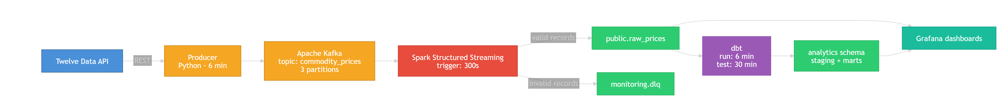
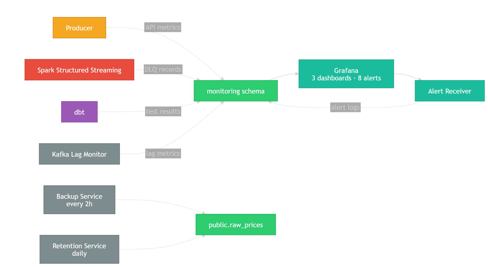

# Real-Time Commodity Price Streaming System

Near real-time analytics system for commodity prices (Gold/XAU, Bitcoin/BTC, EUR/USD). Fetches prices from Twelve Data API, streams through Kafka, processes with Spark Structured Streaming into PostgreSQL, transforms with dbt, and visualizes in Grafana.

## Architecture

### Core Data Flow


### Monitoring & Operations


## Prerequisites

### Required Software
| Software | Version | Installation |
|----------|---------|-------------|
| Docker | 24.0+ | [docs.docker.com/get-docker](https://docs.docker.com/get-docker/) |
| Docker Compose | v2.0+ (plugin) | Included with Docker Desktop |
| Git | 2.30+ | [git-scm.com](https://git-scm.com/) |
| Make | any | Pre-installed on Linux/macOS; on Windows use WSL2 |

### System Requirements
- 4+ CPU cores
- 6 GB+ available RAM (services use ~4.5 GB total)
- 10 GB free disk space
- Internet connection (for Twelve Data API)

### API Key
Register for a free API key at [twelvedata.com](https://twelvedata.com/) (8 requests/minute on free tier is sufficient).

## Quick Start (Fresh Machine)

### 1. Clone the repository
```bash
git clone https://github.com/<your-username>/streaming_system.git
cd streaming_system
```

### 2. Create environment file
```bash
cp .env.example .env
```

Edit `.env` and set at minimum:
```
TD_API_KEY=your_twelvedata_api_key_here
```

All other variables have working defaults for local development.

### 3. Start the system
```bash
make real
```

This starts all core services + operational services (backup, retention, kafka-lag monitoring).

### 4. Verify everything is running
```bash
make health
```

All services should show `healthy` within 2-3 minutes.

### 5. Open Grafana
Navigate to [http://localhost:3000](http://localhost:3000)
- Username: `admin` (or value from `.env`)
- Password: `admin` (or value from `.env`)

Three dashboards are auto-provisioned:
- **Market Overview** — live prices, pipeline health, API metrics
- **Market Analysis** — hourly volatility, price events
- **Pipeline & Data Quality** — DLQ, dbt tests, backup status

Data will start appearing after ~6 minutes (first API poll + Spark processing).

## Commands

### Running the System
```bash
make real              # Production: core + ops services
make dev               # Development: adds pgAdmin (5050), Kafka UI (8080)
make down              # Stop all services
make downv             # Stop + remove volumes (DESTROYS Postgres data!)
make health            # Show service health
make logs              # Stream all logs
make logs-core         # Stream core service logs only
make restart           # Restart all services
make ps                # Show service status
```

### dbt
```bash
make dbt-build         # Run dbt build (models + tests) in container
make dbt-deps          # Install dbt packages
make dbt-debug         # Validate dbt profile and connection
```

### Testing & Linting
```bash
pytest -q              # Run unit tests (35+ tests)
ruff check producer tests ops spark  # Lint Python code
```

### Backup & Restore
```bash
make backup                                  # One-off pg_dump
make restore FILE=backup_YYYYMMDD_HHMM.dump  # Restore from dump
```

## Services

| Service | Role | Port | Profile |
|---------|------|------|---------|
| **postgres** | Primary database (PostgreSQL 16.6) | 5432 | core |
| **kafka** | Message broker (KRaft mode, 3 partitions) | — | core |
| **producer** | Fetches prices from Twelve Data API every 6 min | — | core |
| **spark-stream** | Kafka → PostgreSQL via Structured Streaming (trigger 300s) | — | core |
| **dbt-scheduler** | Runs `dbt run` every 6m, `dbt test` every 30m | — | core |
| **grafana** | 3 dashboards, 8 alert rules | 3000 | core |
| **alert-receiver** | Flask webhook listener for Grafana alerts | 5000 | core |
| **kafka-lag** | Monitors Spark consumer lag | — | ops |
| **backup-cron** | pg_dump every 2h, keeps last 360 backups | — | ops |
| **retention** | Cleans old data (90-day TTL) daily | — | ops |
| **pgadmin** | Database admin UI | 5050 | dev |
| **kafka-ui** | Kafka topic/consumer browser | 8080 | dev |

## Database Schemas

| Schema | Purpose |
|--------|---------|
| **public** | `raw_prices` table — Spark sink with idempotent inserts |
| **analytics** | dbt models — staging views + mart tables (latest prices, minute aggregates, price events, hourly volatility) |
| **monitoring** | Operational metrics — API calls, Kafka lag, DLQ events, alert events, dbt test runs, backup log |
| **ingest** | Spark staging tables (temporary, per-batch) |

## dbt Models

| Model | Type | Description |
|-------|------|-------------|
| `stg_raw_prices` | view | Type casting, timezone handling |
| `mart_latest_prices` | table | Latest price per instrument |
| `mart_minute_last_price` | incremental | Minute-level aggregated statistics |
| `mart_price_events` | incremental | Significant price changes with per-commodity thresholds |
| `mart_price_volatility_1h` | incremental | Hourly volatility metrics |

## Key Design Decisions

- **Idempotent inserts** — `ON CONFLICT (event_id) DO NOTHING` prevents duplicates
- **Dead Letter Queue** — malformed Kafka records go to `monitoring.dead_letter_events`
- **Checkpoint-based offsets** — Spark manages Kafka offsets via checkpoint directory
- **FX weekend gating** — XAU/USD and EUR/USD not published Fri 22:00 – Sun 21:59:59 UTC (BTC is 24/7)
- **5 database roles** — least-privilege access (spark_writer, dbt_runner, grafana_read, producer_writer, backup_user)
- **Price bounds validation** — XAU: $500–$15,000, BTC: $100–$1M, EUR/USD: $0.50–$2.00
- **Deterministic event IDs** — UUID5 based on commodity + timestamp

## CI/CD

| Workflow | Trigger | Description |
|----------|---------|-------------|
| `python-quality.yml` | Push/PR | Ruff lint + pytest (Python 3.11) |
| `dbt-ci.yml` | Push/PR | dbt build against ephemeral Postgres (Python 3.12) |
| `security-trivy.yml` | Push/PR + weekly | Trivy filesystem & image scanning |

## Security

- All container ports bound to `127.0.0.1` (localhost only)
- Containers run with `cap_drop: [ALL]` and `no-new-privileges`
- Read-only volumes for configurations
- Pre-commit hooks: gitleaks (secret detection) + ruff (linting)
- CVE exceptions tracked with quarterly review dates in `.trivyignore`

## Project Structure

```
streaming_system/
├── producer/              # Python API producer
├── spark/                 # Spark Structured Streaming job
├── dbt/                   # dbt models (staging + marts)
├── ops/                   # Operational services
│   ├── alert-receiver/    #   Flask webhook listener
│   ├── dbt-scheduler/     #   Automated dbt runs
│   ├── kafka-lag/         #   Consumer lag monitor
│   ├── retention-image/   #   Data retention cleanup
│   └── sql/               #   Init schema, grants, retention SQL
├── grafana/
│   ├── dashboards/        #   3 provisioned dashboard JSONs
│   └── provisioning/      #   Datasource, dashboard, alerting config
├── tests/                 #   Unit tests (pytest)
├── docs/                  #   Architecture diagrams, technical docs
├── .github/workflows/     #   CI pipelines
├── docker-compose.yml     #   All service definitions
├── Makefile               #   Common commands
└── .env.example           #   Environment variable template
```

## Troubleshooting

| Problem | Cause | Solution |
|---------|-------|---------|
| No data in Grafana | System needs ~6 min for first data | Wait for first poll cycle + Spark trigger |
| Pipeline Status = WARNING | Weekend with 1 instrument (BTC only) | Normal — XAU/EUR are gated on weekends |
| dbt test FAIL | System restart caused `ingest_ts - event_ts > 24h` | Will auto-resolve; see `_staging.yml` tolerance |
| Spark crash-loop | Python version compatibility | Check `spark/validation.py` uses `typing.Dict` not `dict[]` |
| High Pipeline Latency | Producer (360s) + Spark (300s) desync | Normal — max latency ~660s on weekends |

## License

MIT License — see [LICENSE](LICENSE) for details.
