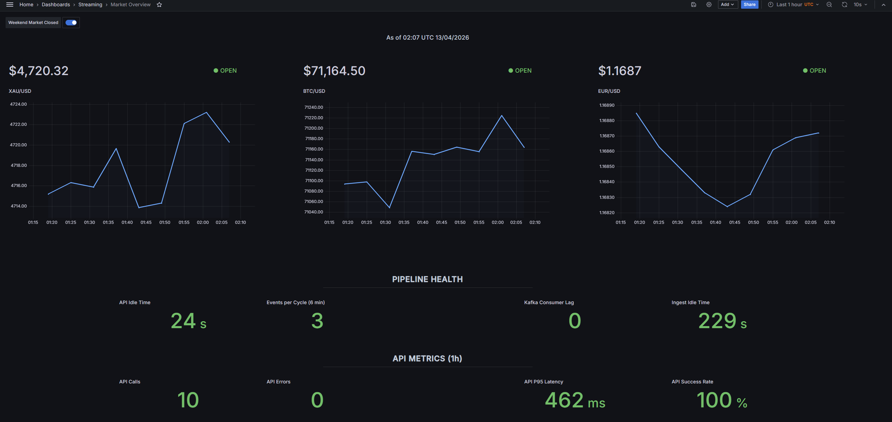
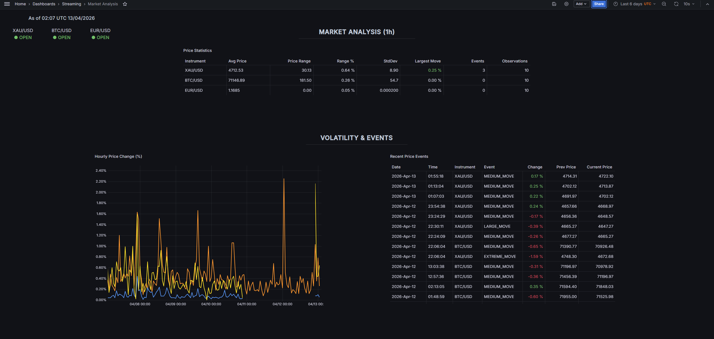
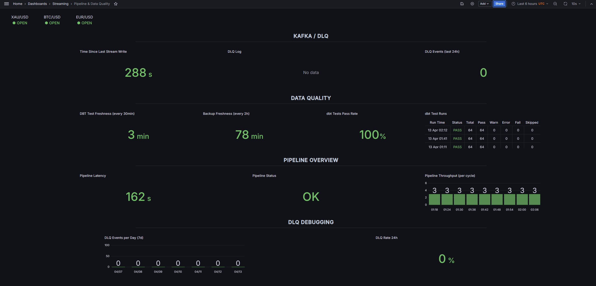

# Near Real-Time Commodity Price Streaming System

Near real-time streaming data pipeline for commodity and FX prices (XAU/USD, BTC/USD, EUR/USD).

Data is ingested every 6 minutes from Twelve Data API and streamed via Kafka. It is then processed with Spark Structured Streaming, stored in PostgreSQL, transformed with dbt, and visualized in Grafana.

**Stack:** Kafka · Spark Structured Streaming · PostgreSQL · dbt · Grafana · Docker

## Key Features

- Kafka + Spark Structured Streaming architecture
- Near real-time pipeline (6–11 min latency)
- Idempotent processing (UUID5 + ON CONFLICT)
- Dead Letter Queue (DLQ) for invalid events
- Data quality layer (64 dbt tests)
- Observability (metrics, logs, alerts)
- Backup & disaster recovery (pg_dump + restore)
- Container hardening + RBAC

## Architecture

### Core Data Flow


End-to-end flow: Twelve Data API → Kafka → Spark Structured Streaming → PostgreSQL → dbt → Grafana.

### Monitoring & Operations


Operational layer including alerts, metrics, backups, and system health monitoring.

## Demo

Example Grafana dashboards showing near real-time prices, pipeline health, and data quality metrics:

**Market Overview**


**Market Analysis**


**Pipeline & Data Quality**


## Why This Project

This master's thesis project demonstrates an end-to-end data engineering system for near real-time ingestion, transformation, monitoring, and recovery.

Compared to traditional batch ETL, it provides faster feedback loops, continuous validation, and built-in operational visibility.

## Key Design Decisions

| Decision | Why |
|----------|-----|
| **Idempotent inserts** (`ON CONFLICT DO NOTHING`) | Deterministic event IDs (UUID5) mean the same event always produces the same ID — enables safe replay after crashes without duplicates |
| **Dead Letter Queue** | Invalid records land in `monitoring.dead_letter_events` with full payload — nothing is silently dropped |
| **Checkpoint-based offsets** | Spark manages Kafka offsets via checkpoint dir, not consumer groups — avoids offset conflicts on restart |
| **Persistent staging + advisory lock** | Batch data lands in a staging table, then merges into target under `pg_advisory_lock` — ensures safe concurrent writes without full table locks |
| **Multi-layer validation** | Price bounds checked at producer (pre-publish) AND Spark (post-consume) — defense in depth |
| **FX weekend gating** | XAU/USD, EUR/USD skipped Fri 22:00 – Sun 21:59 UTC; BTC runs 24/7 — prevents stale quotes from polluting analytics |
| **5 database roles** | Each service gets only the permissions it needs — a compromised component cannot escalate beyond its own schema |
| **Incremental dbt models** | Marts use lookback windows (30m–2h) — constant runtime regardless of table size |
| **Per-commodity event thresholds** | BTC extreme = 1.5%, XAU = 0.6%, EUR = 0.25% — reflects actual market volatility profiles |

## Services

| Service | Role | Profile |
|---------|------|---------|
| **postgres** | PostgreSQL 16.14 (primary storage) | core |
| **kafka** | Apache Kafka (KRaft mode, 3 partitions) | core |
| **producer** | Fetches prices from Twelve Data API every 6 min | core |
| **spark-stream** | Kafka → PostgreSQL via Structured Streaming (trigger 300s) | core |
| **dbt-scheduler** | `dbt build` every 6m, `dbt test` every 30m, retention every 24h | core |
| **grafana** | Grafana (dashboards + alerting) | core |
| **alert-receiver** | Flask webhook (alert ingestion endpoint) | core |
| **kafka-lag** | Monitors Spark consumer lag | ops |
| **backup-cron** | pg_dump every 2h, keeps last 360 backups | ops |
| **retention** | Retention daemon (90-day cleanup every 24h) | ops |
| **spark** | Interactive Spark shell (debugging, runs `sleep infinity`) | always |
| **dbt** | One-off dbt execution container | always |
| **pgadmin** | Database admin UI (port 5050) | dev |
| **kafka-ui** | Kafka topic browser (port 8080) | dev |

## Database & Transformations

**4 schemas:** `public` (Spark sink), `analytics` (dbt models), `monitoring` (operational metrics), `ingest` (persistent Spark staging tables, truncated between batches)

**dbt models:**

| Model | Type | Description |
|-------|------|-------------|
| `stg_raw_prices` | view | Type casting, timezone handling |
| `mart_latest_prices` | view | Latest price per instrument |
| `mart_minute_last_price` | incremental | Minute-level OHLC statistics |
| `mart_price_events` | incremental | Significant price changes with per-commodity thresholds |
| `mart_price_volatility_1h` | incremental | Hourly volatility metrics |

## Monitoring

**3 Grafana dashboards** (auto-provisioned): Market Overview, Market Analysis, Pipeline & Data Quality

**11 alert rules** covering: stale ingest, API errors, DLQ events, dbt test failures, Kafka lag (total + per-partition), BTC heartbeat, backup freshness, analytics staleness. All alerts route through webhook receiver → `monitoring.alert_events`.

**Monitoring tables:**
- `api_calls`
- `dead_letter_events`
- `kafka_lag`
- `alert_events`
- `dbt_test_runs`
- `backup_log`

**Summary monitoring views:**
- `pipeline_metrics`
- `api_metrics_18m`
- `kafka_lag_latest`

This ensures that pipeline failures (ingestion gaps, data quality regressions, consumer lag) are detected in near real-time, surfaced via alerts, and recorded for analysis.

See [Operations Guide](docs/OPERATIONS.md#alert-rules-11-rules) for full alert rule details.

## CI/CD

| Workflow | Trigger | Description |
|----------|---------|-------------|
| `python-quality.yml` | Push/PR | Ruff lint + pytest (Python 3.12) |
| `dbt-ci.yml` | Push/PR | dbt build against ephemeral Postgres (Python 3.12) |
| `security-trivy.yml` | Push/PR + weekly | Trivy filesystem & image scanning |

## Security

The project applies several production-inspired hardening practices (container capability drop, non-root users, read-only rootfs, RBAC with 5 database roles, pre-commit secret scanning, SHA-pinned CI actions), but it is designed as a single-host educational system rather than a fully production-grade distributed deployment.

See [Security](docs/SECURITY.md) for full details.

## Quick Start

### Prerequisites

| Software | Version |
|----------|---------|
| Docker | 24.0+ |
| Docker Compose | v2.0+ (plugin) |
| Git | 2.30+ |
| Make | any |

**System:** 4+ CPU cores, 6 GB+ RAM, 10 GB disk. **API key:** register at [twelvedata.com](https://twelvedata.com/) (free tier is sufficient).

### Setup

```bash
# 1. Clone
git clone https://github.com/hubert99x/streaming-commodity-analytics.git
cd streaming-commodity-analytics

# 2. Configure
cp .env.example .env
# Edit .env — set TD_API_KEY at minimum, review passwords

# 3. Start (Kafka, Spark, PostgreSQL, dbt, Grafana + operational services)
make real

# 4. Verify
make health          # all services should show "healthy" within ~2 min

# 5. Open Grafana at http://localhost:3000 (credentials in .env)
```

This starts all core services and operational jobs required for the full pipeline (Kafka, Spark, PostgreSQL, dbt, Grafana). Initial startup may take 1–2 minutes while containers initialize.

### What to Expect After Startup

- Producer polls Twelve Data API every **6 minutes**
- Spark processes micro-batches every **5 minutes** (trigger interval)
- dbt transforms run every **6 minutes**, tests every **30 minutes**
- First data appears in Grafana after **~6–12 minutes** (first poll + Spark trigger)
- On weekends, only BTC/USD updates continuously — XAU/USD and EUR/USD are gated (Fri 22:00 – Sun 21:59 UTC)
- You can verify ingestion directly in PostgreSQL (`public.raw_prices`) — see [Troubleshooting](docs/TROUBLESHOOTING.md#diagnostics)
- Kafka topic activity can be inspected via Kafka UI (`make dev`, port 8080)
- If services are not healthy, check logs: `make logs-core`

**Pipeline is considered healthy when:**
- API calls are successful (no sustained errors in `monitoring.api_calls`)
- new rows continuously appear in `public.raw_prices`
- Kafka lag remains near zero (no growing backlog)
- no active alerts in Grafana

## Project Structure

```
streaming-commodity-analytics/
├── producer/              # Python API producer
├── spark/                 # Spark Structured Streaming job
├── dbt/                   # dbt models (staging + marts)
├── ops/                   # Operational services (monitoring, alerts, scheduling)
│   ├── alert-receiver/    #   Flask webhook listener
│   ├── dbt-scheduler/     #   Automated dbt runs
│   ├── kafka-lag/         #   Consumer lag monitor
│   └── sql/               #   Init schema, grants, retention SQL
├── grafana/
│   ├── dashboards/        #   3 provisioned dashboard JSONs
│   └── provisioning/      #   Datasource, dashboard, alerting config
├── tests/                 #   Unit tests (pytest)
├── docs/                  #   Architecture diagrams, technical docs
├── .github/workflows/     #   CI pipelines
├── docker-compose.yml     #   All service definitions
├── Makefile               #   Common commands
└── .env.example           #   Environment variable template
```

## Documentation

| Document | Description |
|----------|-------------|
| [Operations Guide](docs/OPERATIONS.md) | Commands, dashboards, alert rules, checkpoints, volume management |
| [Troubleshooting](docs/TROUBLESHOOTING.md) | Common issues, diagnostics, DLQ investigation |
| [Disaster Recovery](docs/DISASTER_RECOVERY.md) | Backup/restore procedures, volume management |
| [Security](docs/SECURITY.md) | Container hardening, RBAC, CI scanning |
| [Technical Documentation](docs/TECHNICAL_DOCUMENTATION.md) | Deep-dive architecture analysis, weaknesses, recommendations |

## Limitations

- Single-node deployment (Docker Compose)
- No high availability (single PostgreSQL instance, single Kafka broker, no replication or failover)
- No TLS between services
- Kafka runs without authentication (PLAINTEXT)
- Backups are not encrypted
- Not designed for horizontal scaling

This system is intended for educational and portfolio use, while applying production-inspired design patterns and operational practices.

## License

This project is licensed under the MIT License. See the [LICENSE](LICENSE) file for details.
